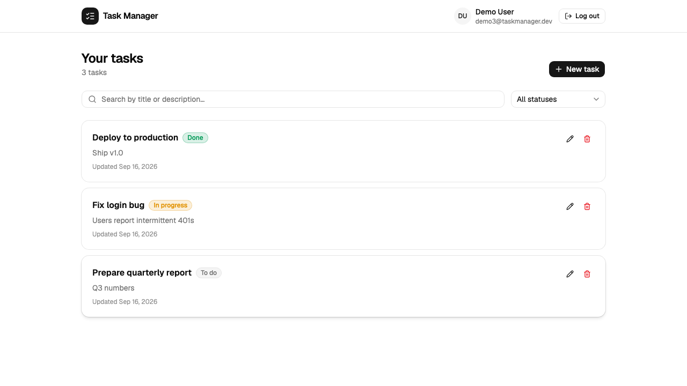
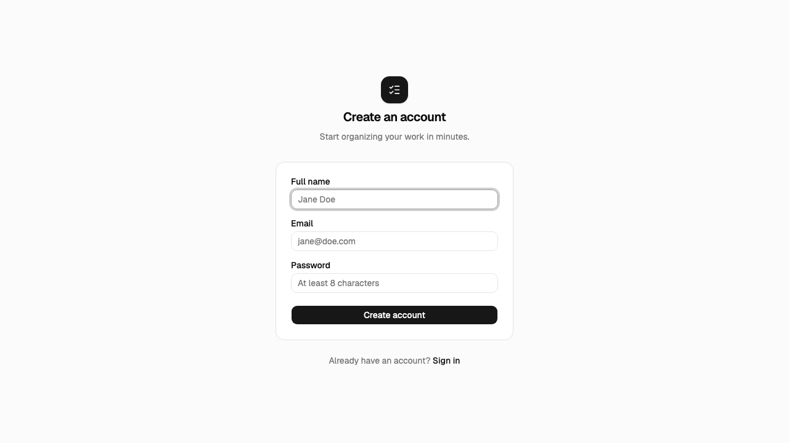
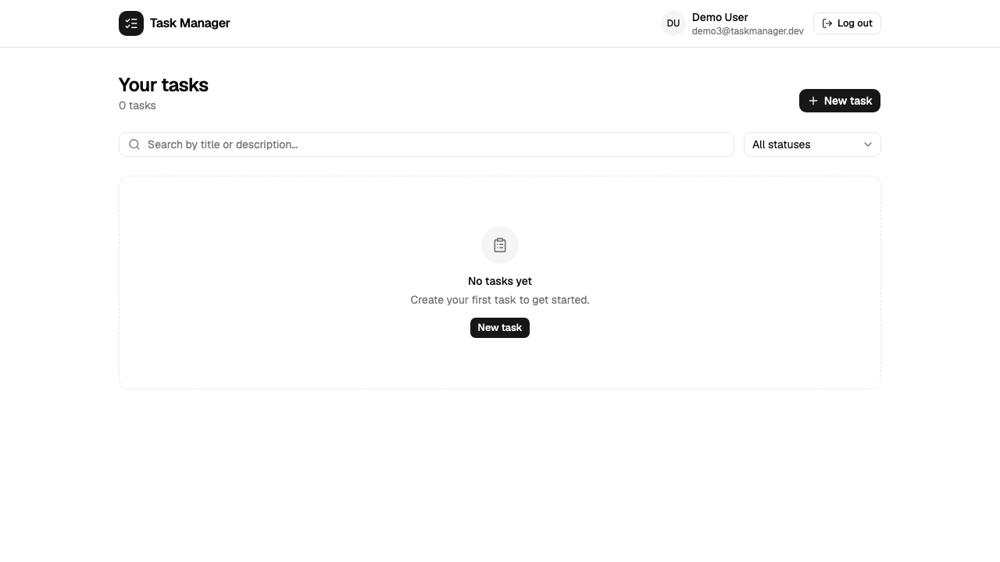
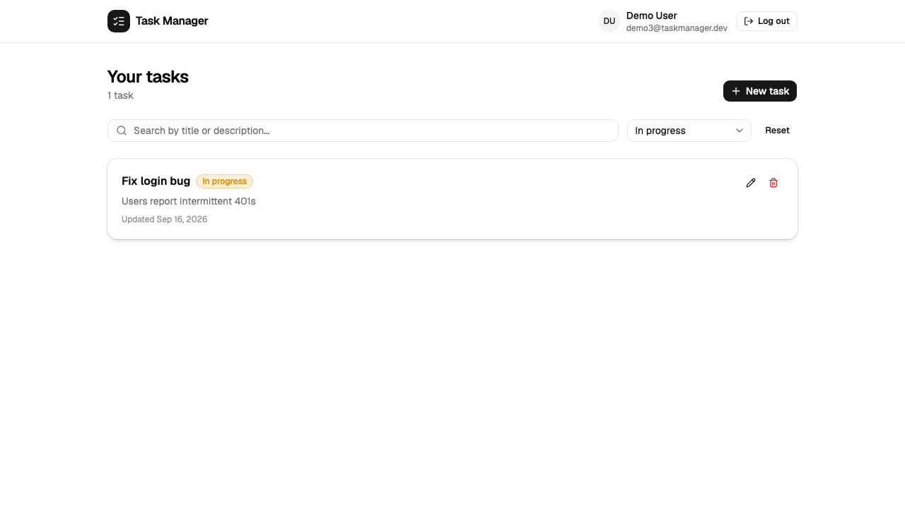
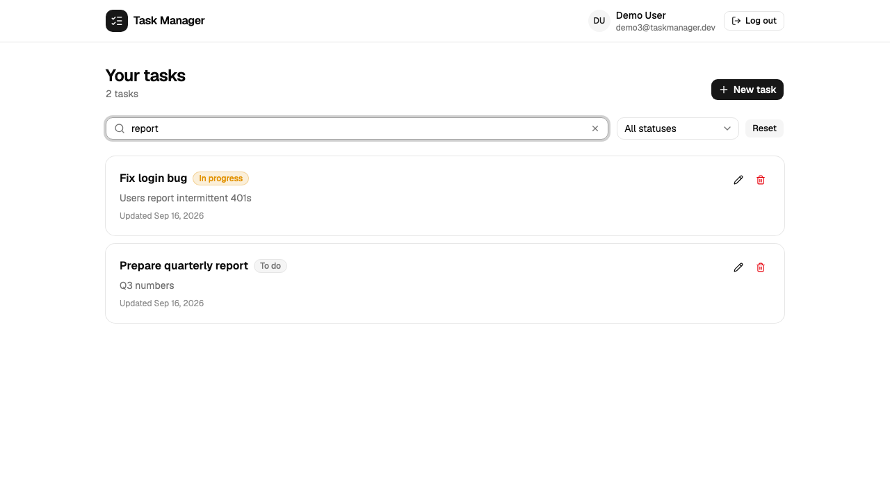

# Task Manager

Application complète de gestion de tâches : API REST Spring Boot, interface web React,
application mobile Flutter, le tout partageant le même contrat d'API, avec CI/CD et
déploiement Docker/GCP prêts à l'emploi.

Construit en réponse au `TEST DE RECRUTEMENT.pdf` de ce dépôt. Voir [`TRACKING.md`](./TRACKING.md)
pour le détail exigence par exigence, et [`CONTRACT.md`](./CONTRACT.md) pour le contrat d'API
partagé entre les trois clients.

## Aperçu

| Web | Mobile |
|---|---|
|  | Onboarding liquid-swipe, mode hors-ligne, animations — voir `mobile/README.md` |

<details>
<summary>Plus de captures d'écran (web)</summary>

| Inscription | Dashboard vide | Filtrage par statut | Recherche |
|---|---|---|---|
|  |  |  |  |

</details>

## Stack technique

| Domaine | Technologies |
|---|---|
| Frontend web | React 19 + Vite + TypeScript + Tailwind CSS v4 + shadcn/ui |
| Backend API | Java 21 + Spring Boot 3.3 + Spring Data JPA + Spring Security + JWT + MySQL |
| Mobile (bonus) | Flutter + Dart, `dio`, `provider`, `hive`, `connectivity_plus`, `liquid_swipe` |
| CI/CD | GitHub Actions (build + tests) + Docker + déploiement Cloud Run |
| Local | Docker Compose (MySQL + backend + frontend en une commande) |

## Architecture

```
┌─────────────┐        ┌──────────────┐        ┌───────────┐
│  React SPA  │──HTTP─▶│ Spring Boot  │──JDBC─▶│   MySQL   │
│  (Vite/TSX) │  /api  │  REST API    │        │           │
└─────────────┘        │  + JWT auth  │        └───────────┘
                        └──────▲───────┘
                               │ HTTP (même API)
                        ┌──────┴───────┐
                        │ Flutter app  │──▶ cache local (Hive) + file
                        │ (mobile)     │    de synchronisation hors-ligne
                        └──────────────┘
```

- **Un seul contrat d'API** ([`CONTRACT.md`](./CONTRACT.md)) consommé à l'identique par le
  frontend web et l'application mobile.
- **JWT stateless** : chaque tâche est strictement scopée à l'utilisateur authentifié
  côté serveur (jamais fait confiance à un id client).
- **Mobile offline-first** : les mutations effectuées hors-ligne sont mises en file
  d'attente localement (Hive) et synchronisées automatiquement au retour du réseau.

## Structure du monorepo

```
backend/    API Spring Boot (Java 21, Maven)
frontend/   SPA React + Vite + TypeScript
mobile/     Application Flutter
docs/       Captures d'écran
.github/workflows/   Pipelines CI/CD
docker-compose.yml   Stack complète en local
CONTRACT.md          Contrat d'API partagé
TRACKING.md          Suivi détaillé de l'avancement
```

## Démarrage rapide (local)

### Option 1 — tout via Docker (recommandé)

Prérequis : Docker + Docker Compose.

```bash
git clone https://github.com/daniel10027/Task_Manager.git
cd Task_Manager
docker compose up --build
# ou : make up   /   ./scripts/dev.sh docker
```

- Frontend : http://localhost:5173
- API backend : http://localhost:8080 (santé : `/actuator/health`)
- MySQL : `localhost:3306` (db `taskmanager` / user `taskmanager` / password `taskmanager`)

Le frontend est servi par nginx et proxifie `/api/*` vers le backend — aucune configuration
supplémentaire n'est nécessaire.

### Option 2 — backend/frontend natifs, MySQL en Docker

```bash
make native
# ou : ./scripts/dev.sh native
```

Nécessite un JDK 21 + Maven (`brew install openjdk@21 maven`) et Node 20+.

### Backend seul

```bash
cd backend
mvn spring-boot:run
# variables d'env optionnelles : DB_HOST, DB_PORT, DB_NAME, DB_USER, DB_PASSWORD, JWT_SECRET
```

### Frontend seul

```bash
cd frontend
npm install
cp .env.example .env   # VITE_API_URL=http://localhost:8080
npm run dev
```

### Mobile

```bash
cd mobile
flutter pub get
flutter run --dart-define=API_BASE_URL=http://localhost:8080   # iOS simulator / desktop
# Android emulator : http://10.0.2.2:8080 (valeur par défaut si non précisé)
```

## Tests

| Module | Commande | Résultat vérifié |
|---|---|---|
| Backend | `cd backend && mvn test` | 39 tests (services, contrôleurs MockMvc, `@DataJpaTest`) — tous verts |
| Frontend | `cd frontend && npm run test` | 13 tests (Vitest + Testing Library + MSW) — tous verts |
| Mobile | `cd mobile && flutter test` | 27 tests (widgets + unitaires sync/offline) — tous verts, `flutter analyze` clean |

`make test` lance les trois suites d'un coup.

Le flux complet (inscription → connexion → CRUD → filtres → recherche) a été vérifié de
bout en bout contre la stack Docker Compose réelle (API + MySQL + frontend), captures
d'écran à l'appui ci-dessus.

## Référence API

Voir [`CONTRACT.md`](./CONTRACT.md) pour le détail complet (corps de requête, validation,
codes d'erreur). Résumé :

| Méthode | Endpoint | Description | Auth |
|---|---|---|---|
| POST | `/api/auth/register` | Inscription | non |
| POST | `/api/auth/login` | Connexion (retourne un JWT) | non |
| GET | `/api/tasks?status=&search=` | Liste des tâches (filtrage + recherche) | oui |
| POST | `/api/tasks` | Créer une tâche | oui |
| PUT | `/api/tasks/{id}` | Modifier une tâche | oui |
| DELETE | `/api/tasks/{id}` | Supprimer une tâche | oui |
| GET | `/actuator/health` | Healthcheck | non |

Authentification : `Authorization: Bearer <token>`.

## CI/CD

Quatre pipelines GitHub Actions (`.github/workflows/`), déclenchés sur push/PR vers `main` :

- **backend-ci.yml** — build Maven + suite de tests complète (JDK 21, cache Maven)
- **frontend-ci.yml** — lint (oxlint) + tests (Vitest) + build de production
- **mobile-ci.yml** — `flutter analyze` + `dart format --set-exit-if-changed` + `flutter test`
- **cd.yml** — build des images Docker (backend + frontend) ; si les secrets GCP sont
  configurés, push vers Artifact Registry puis déploiement sur Cloud Run — sinon l'étape
  de déploiement est proprement ignorée (le pipeline reste vert) au lieu d'échouer

Tous vérifiés en conditions réelles sur ce dépôt après chaque push.

## Déploiement sur GCP Cloud Run

Le pipeline `cd.yml` est prêt à l'emploi. Pour l'activer, définir ces secrets GitHub
(Settings → Secrets and variables → Actions) sur le dépôt :

| Secret | Description |
|---|---|
| `GCP_PROJECT_ID` | ID du projet GCP |
| `GCP_SA_KEY` | Clé JSON d'un compte de service avec les rôles `artifactregistry.writer`, `run.admin`, `iam.serviceAccountUser` |
| `GCP_REGION` | Région Cloud Run (optionnel, défaut `europe-west1`) |
| `DB_HOST`, `DB_NAME`, `DB_USER`, `DB_PASSWORD` | Connexion à la base MySQL de production (ex. Cloud SQL) |
| `APP_JWT_SECRET` | Secret JWT de production (32+ caractères aléatoires) |

Une fois ces secrets renseignés, tout push sur `main` qui touche `backend/` ou `frontend/`
build les images, les pousse sur Artifact Registry, déploie le backend sur Cloud Run, récupère
son URL, puis build et déploie le frontend avec cette URL backend déjà intégrée au bundle
(`VITE_API_URL` passé en `--build-arg` au moment du build, car les variables Vite ne sont pas
disponibles à l'exécution d'un conteneur statique).

Déploiement manuel équivalent (une fois `gcloud` configuré) :

```bash
gcloud run deploy taskmanager-backend --source backend --region europe-west1 --allow-unauthenticated
gcloud run deploy taskmanager-frontend --source frontend --region europe-west1 --allow-unauthenticated \
  --set-build-env-vars VITE_API_URL=<url-backend-obtenue-ci-dessus>
```

## Choix techniques notables

- **JWT stateless plutôt que sessions** : simplicité de scaling horizontal, un seul
  mécanisme d'auth partagé entre web et mobile.
- **`@DataJpaTest` avec `Replace.NONE`** côté backend : garde le H2 configuré
  explicitement (`application-test.yml`) plutôt que le datasource auto-généré par défaut,
  pour un schéma de test déterministe.
- **Proxy nginx dynamique** côté frontend : résolution DNS Docker paresseuse (`resolver
  127.0.0.11`) pour que l'image ne plante pas au démarrage si le service `backend` n'est
  pas encore sur le réseau ; le chemin complet (`$request_uri`) est explicitement
  réinjecté dans `proxy_pass`, faute de quoi nginx tronque le chemin quand la cible du
  proxy contient une variable (piège classique, détecté et corrigé pendant les tests
  end-to-end de ce projet).
- **Mobile offline-first** : chaque mutation passe par un point d'entrée unique
  (`task_repository.dart`) qui décide de manière transparente pour l'UI d'appeler l'API
  directement (en ligne) ou d'écrire en local + mettre en file d'attente (hors ligne),
  avec coalescing des opérations et réconciliation des identifiants après synchronisation.

## Problèmes connus / dépannage

- **Build Maven natif + Lombok sur certains builds Homebrew d'OpenJDK 21** : une
  incompatibilité connue entre Lombok et certains bottles Homebrew d'`openjdk@21` peut
  faire échouer `mvn compile` en natif (`ExceptionInInitializerError` sur
  `com.sun.tools.javac.code.TypeTag`) alors que tout fonctionne normalement avec le JDK
  Eclipse Temurin officiel (utilisé dans le `Dockerfile` et en CI). Si ça arrive :
  utilisez `docker build`/`docker compose` pour builder et tester le backend, ou
  installez un JDK 21 Temurin (`brew install --cask temurin@21`) à la place de
  `openjdk@21`.

## Suivi du projet

Voir [`TRACKING.md`](./TRACKING.md) pour la checklist complète, exigence par exigence,
de ce qui est fait.
